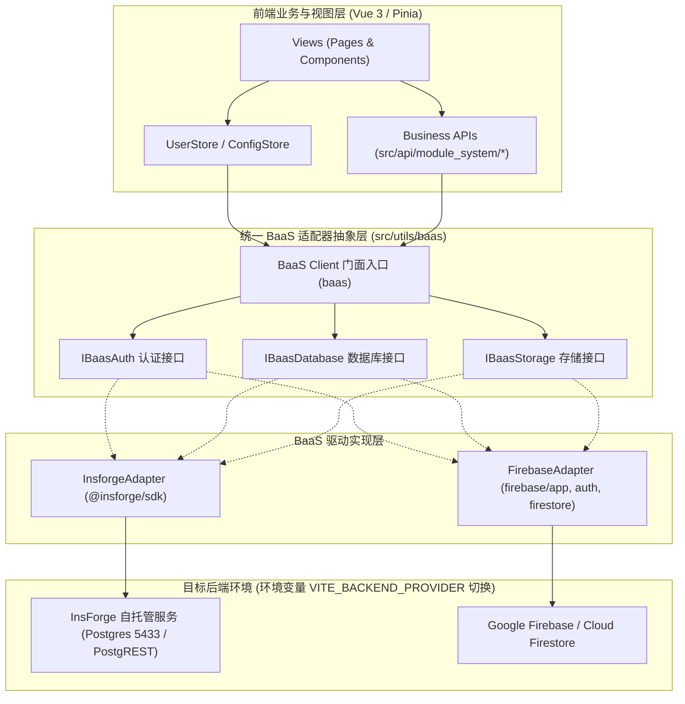

# 阶段1: ALIGN (对齐阶段) - 后端多 BaaS 配置与适配 (InsForge / Firebase)

> 文档路径: `docs/后端多BaaS配置_InsForge与Firebase/ALIGNMENT_后端多BaaS配置_InsForge与Firebase.md`  
> 规范依据: 团队 6A 工作流程规范 (阶段1: Align)  
> 责任角色: 资深软件架构师 & 系统工程专家 (Gemini)  
> 当前状态: 待对齐与共识确认  

---

## 1. 任务背景与核心诉求

### 1.1 原始需求
> “基于6A工作流，将后端改为Insforge或者Firebase，项目初始化的时候可以选择具体的后端”

### 1.2 现状分析与痛点
1. **单 BaaS 强绑定**：当前 GravityD 中后台脚手架深度绑定了自托管 **InsForge**（基于 PostgreSQL + PostgREST + InsForge Auth），前端 `src/api/*` 与 `src/utils/*` 大量直接调用 `@insforge/sdk` 和 `insforge.database.from(...)`。
2. **初始化缺乏多后端选择机制**：当前 `scripts/init.sh` 与 `packages/gravityd-cli` 默认只能针对本地 Docker 中的 InsForge 进行克隆与迁移，无法在工程初始化阶段根据团队选型灵活配置 Firebase 或 InsForge。
3. **多云与出海诉求**：在国际化或 Google Cloud 生态场景下，**Firebase**（Firebase Auth + Cloud Firestore + Firebase Storage）是行业主流 BaaS；而在自托管与国内场景下，**InsForge / Supabase** 是首选方案。
4. **架构挑战**：
   - **初始化流程分流**：InsForge 需要拉起 Docker 容器、执行 SQL 迁移（001~006）并写入超管；Firebase 则需要配置 Google Cloud / Firebase 项目连接凭据（apiKey、projectId 等）并提供 Firestore 集合初始化与种子播种。
   - **数据模型差异**：PostgreSQL (关系型 SQL 表 + 严格外键约束) vs Firestore (NoSQL Document + Collection)。
   - **认证体系差异**：InsForge JWT Session vs Firebase Auth Token (Google ID Token / Custom Claims)。
   - **查询与分页差异**：PostgREST 原生 `range` 与 SQL 过滤 vs Firestore `where` / `orderBy` / `limit` / `startAfter` / 游标分页。

---

## 2. 边界确认 (Scope & Boundary)

### 2.1 纳入本次任务范围 (In Scope)
1. **项目初始化多后端选择机制 (Initialization CLI & Scripts)**：
   - `scripts/init.sh` 升级：支持交互式菜单选择 `[1] InsForge (默认自托管)` 或 `[2] Firebase (Google Cloud BaaS)`，支持命令行参数非交互式执行（`bash scripts/init.sh --provider=insforge|firebase`）。
   - `packages/gravityd-cli` 升级：在 `gravityd link` / `init` 阶段支持 `--provider=insforge|firebase` 选型，自动生成与注入对应环境变量。
   - `scripts/seed-firebase.mjs` / `seed-firebase.ts`：提供一键为 Firebase Firestore 播种初始菜单、角色、部门、超管账号的自动化工具。
2. **统一 BaaS 抽象层架构设计 (Unified BaaS Abstraction Layer)**：
   - 设计统一的客户端接口定义：`IBaasClient`、`IBaasAuth`、`IBaasDatabase`、`IBaasStorage`。
   - 统一定义查询构造器（Filter DSL / Order / Pagination）、响应格式标准（`ok()`、`pageOf()`、`serverPageOf()`）与错误处理体系。
3. **双后端适配器实现 (Adapters)**：
   - `InsforgeAdapter`：完整复用与封装现有 InsForge 能力，确保 100% 现有功能零退化。
   - `FirebaseAdapter`：引入最新版 `firebase` SDK，实现 Firebase Auth 账号密码认证、Firestore 集合 CRUD、条件过滤、排序、分页与实时感知。
4. **可插拔配置与运行时管理**：
   - 环境变量与构建配置支持（`.env` 配置 `VITE_BACKEND_PROVIDER=insforge|firebase`）。
   - 提供统一的 BaaS 统一入口 `src/utils/baas/index.ts`，自动根据配置路由并加载对应驱动，支持在系统设置面板中动态查看与切换。
5. **系统核心 API 与状态解耦改造**：
   - 重构 `src/api/module_system/*`、`src/api/module_monitor/*`、`src/store/modules/user.store.ts`，彻底解除对单一厂商 SDK 的耦合。
6. **完备的类型系统与自动化验证**：
   - TypeScript 类型契约严格覆盖，双模式下编译无报错、单测与类型检查全通过。

### 2.2 明确排除范围 (Out of Scope)
- 不做双 BaaS 之间实时双向数据同步（单一运行时仅连接选定的后端提供商）。
- 不复活已废弃的 FastAPI 8001 主后端，恪守现代 Serverless / BaaS 架构路线。
- 不破坏现有 InsForge PostgreSQL 数据库迁移历史（`001-007`）。

---

## 3. 架构方案与关键技术对齐

---

## 4. 关键决策点与待澄清问题清单 (智能决策)

基于项目架构与工程最佳实践，提出以下 4 项核心决策供用户确认：

### 决策 1：后端切换粒度与生效机制
- **推荐选项**：环境变量/构建期静态配置 (`VITE_BACKEND_PROVIDER=insforge|firebase`)。
- **依据**：包体积可按需摇树优化，运行时安全可控，隔离不同环境的 API Key 与配置。

### 决策 2：Firebase 数据集组织结构
- **推荐选项**：扁平化顶级集合（Top-level Collections，如 `sys_menu`, `sys_role`, `profiles`, `sys_dept`）。
- **依据**：与当前 InsForge PostgreSQL 表名和模型 1:1 映射，降低 API 抽象层的复杂度与适配器转换损耗。

### 决策 3：功能覆盖范围与降级策略
- **推荐选项**：全量系统管理与认证核心模块对齐（Auth、User、Role、Menu、Dept、Dict、Notice、Position、Version、Ticket、Log、Online）。
- **依据**：保证切换至 Firebase 后，整套后台管理系统全链路可用。

### 决策 4：工程改造范围
- **推荐选项**：优先落地 `frontend/web` 管理后台的双 BaaS 架构，建立标准适配规范，后续无缝推广至移动端。
- **依据**：`frontend/web` 是系统功能最全、使用 InsForge 场景最集中的主力工程。
