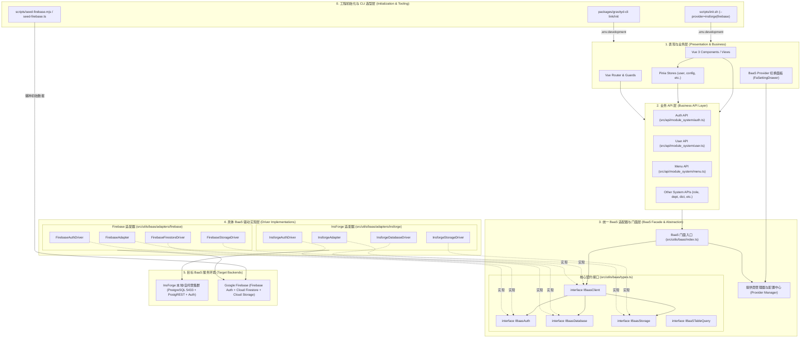
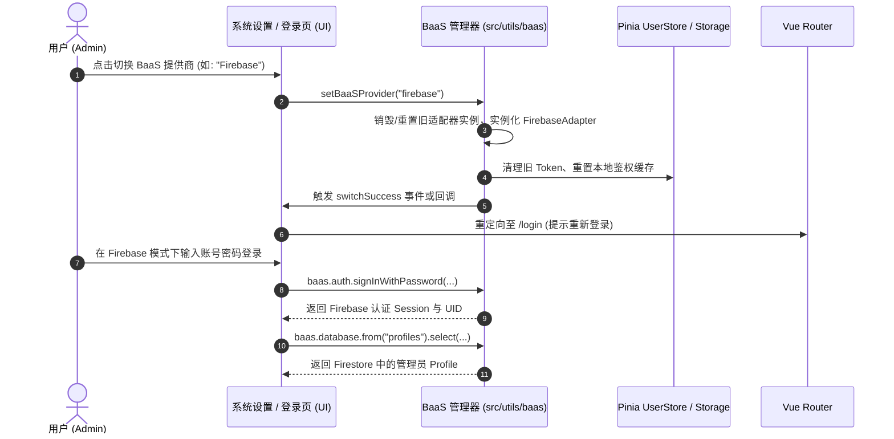

# 阶段2: DESIGN (架构阶段) - 后端多 BaaS 配置与适配 (InsForge / Firebase)

> 文档路径: `docs/后端多BaaS配置_InsForge与Firebase/DESIGN_后端多BaaS配置_InsForge与Firebase.md`  
> 规范依据: 团队 6A 工作流程规范 (阶段2: Architect)  
> 责任角色: 资深软件架构师 & 系统工程专家 (Gemini)  
> 状态: 架构设计完成  

---

## 1. 整体系统架构与分层设计

### 1.1 总体架构图 (Mermaid)



---

## 2. 核心组件与接口契约设计 (Interface Contracts)

### 2.1 BaaS 提供商与配置类型

```typescript
export type BaaSProviderType = "insforge" | "firebase";

export interface BaaSConfig {
  provider: BaaSProviderType;
  insforge?: {
    baseUrl: string;
    anonKey: string;
  };
  firebase?: {
    apiKey: string;
    authDomain: string;
    projectId: string;
    storageBucket: string;
    messagingSenderId?: string;
    appId: string;
  };
}
```

### 2.2 统一核心接口契约 (`src/utils/baas/types.ts`)

```typescript
export interface IBaasAuthUser {
  id: string;
  email: string;
  displayName?: string;
  avatarUrl?: string;
}

export interface IBaasAuthSession {
  accessToken: string;
  refreshToken?: string;
  expiresIn?: number;
  user?: IBaasAuthUser;
}

export interface IBaasAuth {
  signInWithPassword(params: { email: string; password: string }): Promise<{
    data: IBaasAuthSession | null;
    error: Error | null;
  }>;
  signUp(params: { email: string; password: string; metadata?: Record<string, any> }): Promise<{
    data: { user: IBaasAuthUser; accessToken?: string } | null;
    error: Error | null;
  }>;
  signOut(): Promise<void>;
  getCurrentUser(): Promise<{ data: { user: IBaasAuthUser | null }; error: Error | null }>;
  setAccessToken(token: string | null): void;
  getAccessToken(): string | null;
}

export interface IBaaSTableQuery<T = any> {
  select(columns?: string, options?: { count?: "exact" | "planned" | "estimated"; head?: boolean }): this;
  eq(column: string, value: any): this;
  neq(column: string, value: any): this;
  in(column: string, values: any[]): this;
  like(column: string, pattern: string): this;
  ilike(column: string, pattern: string): this;
  gte(column: string, value: any): this;
  lte(column: string, value: any): this;
  order(column: string, options?: { ascending?: boolean }): this;
  range(from: number, to: number): Promise<{ data: T[] | null; error: Error | null; count?: number | null }>;
  insert(values: Partial<T>[] | Partial<T>): Promise<{ data: T[] | null; error: Error | null }>;
  update(values: Partial<T>): Promise<{ data: T[] | null; error: Error | null }>;
  delete(): Promise<{ data: T[] | null; error: Error | null }>;
  single(): Promise<{ data: T | null; error: Error | null }>;
}

export interface IBaasDatabase {
  from<T = any>(tableOrCollection: string): IBaaSTableQuery<T>;
}

export interface IBaasStorage {
  upload(bucket: string, path: string, file: File | Blob): Promise<{ data: { path: string; url: string } | null; error: Error | null }>;
  getPublicUrl(bucket: string, path: string): string;
}

export interface IBaasClient {
  readonly provider: BaaSProviderType;
  readonly auth: IBaasAuth;
  readonly database: IBaasDatabase;
  readonly storage: IBaasStorage;
  initialize(): Promise<void>;
}
```

---

## 3. 驱动层核心设计 (Driver Implementation Details)

### 3.1 InsForge 驱动实现 (`InsforgeAdapter`)
- 包装现有 `@insforge/sdk` 的 `createClient`。
- `from(table)` 直接委托给 `@insforge/sdk` 的 `insforge.database.from(table)`。
- 保留 `serverPageOf` 原生 PostgREST range 与 count 支持。

### 3.2 Firebase 驱动实现 (`FirebaseAdapter`)
- 引入官方模块化 SDK：
  ```typescript
  import { initializeApp, getApps, getApp } from "firebase/app";
  import { getAuth, signInWithEmailAndPassword, signOut, createUserWithEmailAndPassword } from "firebase/auth";
  import { getFirestore, collection, doc, getDocs, getDoc, setDoc, updateDoc, deleteDoc, query, where, orderBy, limit, count } from "firebase/firestore";
  import { getStorage, ref, uploadBytes, getDownloadURL } from "firebase/storage";
  ```
- **Firestore 查询映射器 (`FirestoreQueryBuilder`)**：
  - 维持与 PostgREST 链式 DSL 一致的接口 (`.select()`, `.eq()`, `.in()`, `.order()`, `.range(from, to)`)。
  - `.eq(col, val)` → 累加 `where(col, "==", val)`。
  - `.in(col, vals)` → 处理 Firestore `in` 限制（切片或批量查询），累加 `where(col, "in", vals)`。
  - `.like(col, val)` → 转换为前缀范围查询或客户端内存模糊匹配。
  - `.range(from, to)` → 使用 Firestore `getCountFromServer(q)` 获取真实精确总条数，通过游标/偏移获取当前分页数据切片。
  - `.insert(data)` → 为文档自动生成或沿用 `id`（支持 UUID / 自增 ID 字符串），调用 `setDoc(doc(col, id), item)`。
  - `.update(data)` → 执行批量 `updateDoc`。
  - `.delete()` → 执行批量 `deleteDoc`。

---

## 4. 运行时动态切换与数据流 (Data Flow)

### 4.1 动态切换提供商流程图 (Mermaid)



---

## 5. 异常处理与降级策略

1. **统一错误封装**：
   - 适配器层所有抛出/返回的错误统一包装为 `BaaSError`，屏蔽底层差异（例如 Firebase 的 `auth/user-not-found` 与 PostgREST 的 `PGRST116` 统一标准化为通用的业务错误信息）。
2. **鉴权失效检测**：
   - `isBaaSAuthError(error)` 统一拦截 401 / Token 过期，驱动全局路由守卫跳转登录。
3. **Firestore 缺失集合/字段优雅降级**：
   - 当初次接入 Firebase 且部分非核心表未初始化时，查询返回空数组 `[]` 并打印友好 Warning，不引发页面白屏崩溃。

---

## 6. 质量门控核对

- [x] 架构图完整、分层清晰，职责单一
- [x] 接口契约定义完整且支持 TypeScript 严格类型推导
- [x] 与现有系统 API、UI 组件和 Store 100% 兼容，无侵入破坏
- [x] 覆盖 InsForge 与 Firebase 的全功能对齐，设计可行性验证完毕
