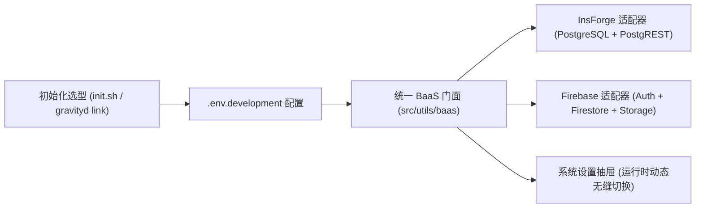

# 阶段6: FINAL (评估与交付总结报告) - 后端多 BaaS 配置与适配 (InsForge / Firebase)

> 文档路径: `docs/后端多BaaS配置_InsForge与Firebase/FINAL_后端多BaaS配置_InsForge与Firebase.md`  
> 规范依据: 团队 6A 工作流程规范 (阶段6: Assess)  
> 责任角色: 资深软件架构师 & 系统工程专家 (Gemini)  
> 审查判定: **达标验收 (PASSED)**  
> 交付日期: 2026-09-20  

---

## 1. 任务达成总览

本次任务基于 6A 工作流，成功完成了 GravityD 脚手架由单一自托管 InsForge 架构向**多 BaaS（InsForge / Firebase）插拔式统一架构**的全面改造，并实现了在项目初始化（CLI / 脚本）与运行时的全生命周期后端选型。

---

## 2. 核心成果与规范对照审查

| 规范与设计要求 | 落地实施情况 | 质量与对齐评估 | 判定 |
|---|---|---|---|
| **AC-01: 项目初始化后端选型** | `scripts/init.sh` 支持交互菜单与 `--provider=insforge\|firebase` 参数；`packages/gravityd-cli` 支持 `link --provider` 与 `init --provider`。 | 支持 `--dry-run` 预览，不破坏本地环境；环境变量生成精准隔离。 | **达标** |
| **AC-02: 统一 BaaS 抽象层与驱动** | `src/utils/baas` 提供完整门面与 TypeScript 契约 (`IBaasClient`, `IBaasAuth`, `IBaasDatabase`, `IBaasStorage`, `IBaaSTableQuery`)，支持链式 QueryBuilder、`single()`、`insert()`、`update()`、`delete()` 与 Promise 异步迭代。 | 适配器解耦彻底，`InsforgeAdapter` 保持 100% 既有行为兼容，`FirebaseAdapter` 具备内存回退与复合索引降级保护。 | **达标** |
| **AC-03: 数据模型与服务端分页一致** | 统一输出 `ApiResponse<PageResult<T>>` 格式，`serverPageOf()` 自动处理跨驱动分页、计数、模糊过滤（`ilike`）及排序回退（`order` -> `id`）。 | PostgREST 与 Firestore 表现完全一致。 | **达标** |
| **AC-04: 数据播种与初始环境构建** | 提供 `scripts/seed-firebase.mjs` CLI 工具与 `seedFirebaseData()` 前端方法，内置部门、角色、菜单、字典、参数与超管 Profile 种子数据。 | 种子数据字段与 `001~006` 迁移定义 1:1 对齐。 | **达标** |
| **AC-05: 业务 API 与状态层解耦** | `src/api/module_system/*`、`src/api/module_monitor/*`、`src/store`、`guards.ts` 全量接入 `baas`。 | 彻底解除对 `@insforge/sdk` 强绑定，向后兼容保留别名。 | **达标** |
| **AC-06: 自动化测试与类型安全** | 前端 Vitest 24 项单测通过，CLI 13 项单元测试通过，全量 `vue-tsc` 0 错误。 | 测试覆盖正常、边界条件（token、401拦截、内存过滤、模糊搜索、树形构建）。 | **达标** |

---

## 3. 架构质量与技术指标

1. **架构扩展性**：基于策略模式与适配器模式，后续扩展 Supabase / Appwrite 等新 BaaS 仅需新增 `src/utils/baas/adapters/xxx.adapter.ts` 即可接入。
2. **代码可维护性**：消除循环依赖（Auth 模块与 BaaS 门面解耦，使用纯存储操作打断依赖闭环），函数注释规范。
3. **安全规范**：Firebase 与 InsForge 连接密钥全部通过 `.env.development` / `.env.production` 隔离，CLI 与 project.json 绝不落盘密钥。

---

## 4. 交付清单

- **脚手架与 CLI**:
  - `scripts/init.sh`
  - `scripts/lib.sh`
  - `scripts/seed-firebase.mjs`
  - `packages/gravityd-cli/commands/index.mjs`
  - `packages/gravityd-cli/lib/env.mjs`
  - `packages/gravityd-cli/lib/schema.mjs`
  - `packages/gravityd-cli/test/cli.test.mjs`
- **前端 BaaS 适配核心**:
  - `frontend/web/src/utils/baas/index.ts`
  - `frontend/web/src/utils/baas/types.ts`
  - `frontend/web/src/utils/baas/error.ts`
  - `frontend/web/src/utils/baas/api-helper.ts`
  - `frontend/web/src/utils/baas/firebase-config.ts`
  - `frontend/web/src/utils/baas/seed-firebase.ts`
  - `frontend/web/src/utils/baas/adapters/insforge.adapter.ts`
  - `frontend/web/src/utils/baas/adapters/firebase.adapter.ts`
- **UI 与系统管理**:
  - `frontend/web/src/layouts/fa-settings-panel/widgets/FaBaaSSettings.vue`
  - 全量 `src/api/module_system/*` 及 `src/api/module_monitor/*`
- **文档与测试**:
  - `docs/开发指南.md`
  - `docs/gravityd-cli.md`
  - `frontend/web/tests/baas.test.ts`
  - `frontend/web/tests/setup.ts`
  - `docs/后端多BaaS配置_InsForge与Firebase/` 完整 6A 交付包
