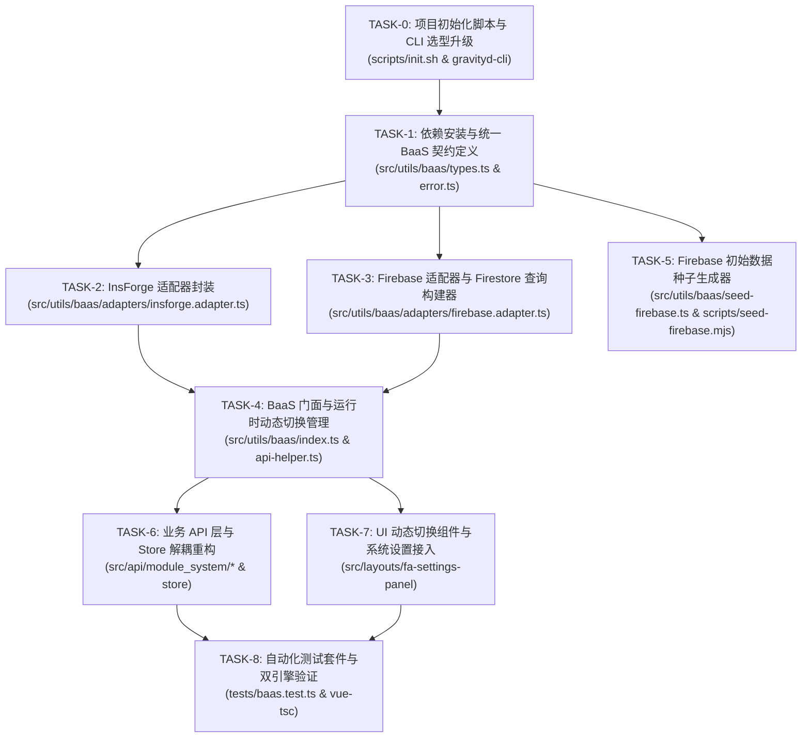

# 阶段3: TASK (原子化阶段) - 后端多 BaaS 配置与适配 (InsForge / Firebase)

> 文档路径: `docs/后端多BaaS配置_InsForge与Firebase/TASK_后端多BaaS配置_InsForge与Firebase.md`  
> 规范依据: 团队 6A 工作流程规范 (阶段3: Atomize)  
> 责任角色: 资深软件架构师 & 系统工程专家 (Gemini)  
> 状态: 任务拆分完成，待审批  

---

## 1. 任务依赖关系图 (Mermaid)

---

## 2. 原子子任务详细规格清单

### TASK-0: 项目初始化脚本与 CLI 选型升级
- **输入契约**: 现有的 `scripts/init.sh`、`scripts/lib.sh`、`packages/gravityd-cli`。
- **实施操作**:
  1. 改造 `scripts/init.sh`：增加命令行参数解析（`--provider=insforge|firebase`）及交互式菜单选择。
  2. 当用户选择 `insforge`：执行原有的 InsForge 克隆、启动与 PostgreSQL 迁移，并在 `frontend/web/.env.development` 中设置 `VITE_BACKEND_PROVIDER=insforge`。
  3. 当用户选择 `firebase`：写入 `VITE_BACKEND_PROVIDER=firebase` 及 Firebase 环境变量模板至 `frontend/web/.env.development`，输出配置指引与 Firebase 种子播种命令提示。
  4. 改造 `packages/gravityd-cli` 中的 `link` 与 `init` 支持 `--provider` 参数。
- **输出契约**: 具备多后端选型能力的 `scripts/init.sh` 与 CLI 工具。
- **验收标准**: 执行 `bash scripts/init.sh --provider=firebase` 与 `bash scripts/init.sh --provider=insforge` 均可平滑完成环境变量配置且无报错。

---

### TASK-1: 依赖安装与统一 BaaS 契约定义
- **输入契约**: `DESIGN_后端多BaaS配置_InsForge与Firebase.md` 中的接口规范。
- **实施操作**:
  1. 在 `frontend/web` 安装 `firebase` 官方依赖包。
  2. 创建 `src/utils/baas/types.ts`，定义 `IBaasClient`, `IBaasAuth`, `IBaasDatabase`, `IBaasStorage`, `IBaaSTableQuery`, `BaaSProviderType` 等核心接口。
  3. 创建 `src/utils/baas/error.ts`，定义 `BaaSError`, `isBaaSAuthError`。
- **输出契约**: 完整的类型定义文件与错误处理基类。
- **验收标准**: TypeScript 编译通过，接口语义无循环引用。

---

### TASK-2: InsForge 适配器封装 (InsforgeAdapter)
- **输入契约**: `TASK-1` 产出的 `IBaasClient` 契约，现有 `src/utils/insforge.ts` 与 `src/utils/insforge-api.ts`。
- **实施操作**:
  1. 创建 `src/utils/baas/adapters/insforge.adapter.ts`。
  2. 实现 `IBaasAuth`（登录、登出、Token 同步、当前用户获取）。
  3. 实现 `IBaasDatabase` 与 `IBaaSTableQuery`，直接桥接 PostgREST 查询。
  4. 实现 `IBaasStorage`，桥接 InsForge 存储服务。
- **输出契约**: `InsforgeAdapter` 类，实现 `IBaasClient`。
- **验收标准**: 原有 InsForge 调用 100% 行为保持一致。

---

### TASK-3: Firebase 适配器与 Firestore 查询构建器 (FirebaseAdapter)
- **输入契约**: `TASK-1` 契约，`firebase` 官方 SDK。
- **实施操作**:
  1. 创建 `src/utils/baas/firebase-config.ts`，支持读取环境变量与默认配置初始化 Firebase App。
  2. 创建 `src/utils/baas/adapters/firebase.adapter.ts`。
  3. 实现 `FirebaseAuthDriver`（Email/Password 登录、登出、Token 提取、用户信息转换）。
  4. 实现 `FirestoreQueryBuilder`（支持 `.select()`, `.eq()`, `.in()`, `.like()`, `.order()`, `.range(from, to)`，`.insert()`, `.update()`, `.delete()`, `.single()`）。
  5. 实现 `FirebaseStorageDriver`（基于 Cloud Storage 的 upload 与 getPublicUrl）。
- **输出契约**: `FirebaseAdapter` 类，实现 `IBaasClient`。
- **验收标准**: 对 Firestore 集合执行 CRUD 及链式分页测试无报错。

---

### TASK-4: BaaS 门面与运行时动态切换管理 (BaaS Facade & Manager)
- **输入契约**: `TASK-2` 与 `TASK-3` 适配器。
- **实施操作**:
  1. 创建 `src/utils/baas/index.ts`，管理当前活跃 BaaS 实例单例。
  2. 实现 `getBaaSProvider(): BaaSProviderType` 与 `setBaaSProvider(provider: BaaSProviderType)`。
  3. 创建 `src/utils/baas/api-helper.ts`，导出通用的 `ok()`, `unwrap()`, `pageOf()`, `rangeOf()`, `buildTree()`, `serverPageOf()`（自动路由到当前活跃驱动的分页机制）。
  4. 向后兼容现有 `src/utils/insforge.ts` 与 `src/utils/insforge-api.ts`（重定向至新 BaaS 抽象层）。
- **输出契约**: 统一的 `baas` 实例导出与辅助函数。
- **验收标准**: 支持动态调用 `setBaaSProvider` 并在切换后正确初始化实例。

---

### TASK-5: Firebase 初始数据种子生成器 (Firebase Seeder)
- **输入契约**: `insforge-app/migrations/001_system_schema.sql`、`005_insforge_menu.sql` 中的预置数据。
- **实施操作**:
  1. 创建 `src/utils/baas/seed-firebase.ts`。
  2. 编写初始化函数 `seedFirestoreData(db)`，预置系统菜单 (`sys_menu`)、超管角色 (`sys_role`)、默认部门 (`sys_dept`)、系统字典 (`sys_dict_type`, `sys_dict_data`) 与管理员 Profile。
- **输出契约**: 可执行的 Firestore 种子脚本/函数。
- **验收标准**: 在空 Firestore 环境下运行后可完整生成管理后台所需的基础数据。

---

### TASK-6: 业务 API 层与 Store 解耦重构
- **输入契约**: `TASK-4` BaaS 门面。
- **实施操作**:
  1. 重构 `src/api/module_system/auth.ts`（使用 `baas.auth` 与 `baas.database`）。
  2. 重构 `src/api/module_system/user.ts`、`menu.ts`、`role.ts`、`dept.ts`、`dict.ts`、`notice.ts`、`position.ts`、`version.ts`、`ticket.ts`、`log.ts`。
  3. 重构 `src/api/module_monitor/online.ts`、`dashboard.ts`。
  4. 重构 `src/store/modules/user.store.ts` 与路由守卫 `src/router/guards.ts`。
- **输出契约**: 完全解除单一厂商依赖的前端 API 与 Store。
- **验收标准**: 消除全部直接从 `@insforge/sdk` 或旧硬编码的直接调用。

---

### TASK-7: UI 动态切换组件与系统设置接入
- **输入契约**: `TASK-4` 提供的动态切换能力。
- **实施操作**:
  1. 在系统设置抽屉 (`src/layouts/fa-settings-panel/widgets/FaThemeSettings.vue` 或新建 `FaBaaSSettings.vue`) 中增加 “BaaS 后端选择” 切换项。
  2. 切换时弹出确认提示框（告知切换后需重新登录对应后端的账号），确认后执行 `setBaaSProvider` 并跳转登录页。
- **输出契约**: 用户友好的前端切换交互。
- **验收标准**: 界面点击切换后，本地配置更新，页面平滑重载并连接新后端。

---

### TASK-8: 自动化测试套件与双引擎验证
- **输入契约**: TASK 1-7 的全部实现产物。
- **实施操作**:
  1. 编写单测文件 `tests/baas.test.ts`，验证 `InsforgeAdapter` 与 `FirebaseAdapter` 在各种查询条件下的行为。
  2. 运行 `pnpm vitest run` 验证所有单测 100% 通过。
  3. 运行 `pnpm vue-tsc --noEmit` 验证项目 TypeScript 类型 100% 无错。
- **输出契约**: 自动化测试套件与执行报告。
- **验收标准**: 单测全部绿灯，构建与类型校验 0 错误。
