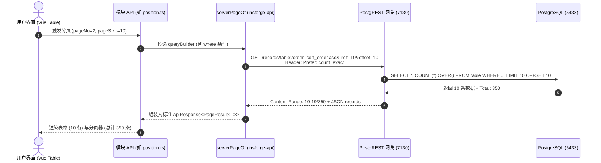

# 阶段2: ARCHITECT (架构设计) - 系统架构审核与治理

> 文档路径: `docs/系统架构审核与治理/DESIGN_系统架构审核与治理.md`  
> 规范依据: 团队 6A 工作流程规范 (阶段2: 系统架构设计)  
> 责任团队: 架构评审委员会  

---

## 一、系统总体架构拓扑图 (Mermaid)

```mermaid
graph TB
    subgraph ClientLayer [客户端接入层]
        WebClient[Vue3 管理后台 / Pinia / Router]
        DevCLI[@gravityd/cli 二次开发脚手架]
    end

    subgraph GatewayLayer [InsForge 网关与认证层 (端口: 7130)]
        AuthService[GoTrue Auth 鉴权服务 (JWT 签发)]
        PostgREST[PostgREST RESTful API 引擎]
    end

    subgraph SecurityKernel [数据库安全与策略内核 (PostgreSQL 5433)]
        RLSEngine{RLS 行级安全过滤引擎}
        AuthHelper[安全辅助函数: current_user_id() / is_superuser()]
        
        subgraph ProtectedSchemas [受保护表空间]
            SysTables[(核心配置与权限表: sys_role, sys_menu, sys_user_roles)]
            ProfileTable[(用户基础表: profiles)]
            BizTables[(业务域数据表: crm_customer 等)]
        end
    end

    WebClient -->|1. 账号密码登录| AuthService
    AuthService -->|2. 返回 JWT (带 sub=UUID)| WebClient
    
    WebClient -->|3. 带 JWT 请求 /api/database/records/| PostgREST
    PostgREST -->|4. 设置 request.jwt.claim.sub| RLSEngine
    
    RLSEngine --> AuthHelper
    AuthHelper -->|行级/列级安全判定| ProtectedSchemas

    DevCLI -->|脚手架生成 / 迁移执行| PostgREST
```

---

## 二、核心分层设计与安全组件规范

### 2.1 数据库行级安全 (RLS) 架构设计

#### 1. 安全判定函数设计 (PL/pgSQL)
- 函数 `public.current_user_id()`：
  ```sql
  CREATE OR REPLACE FUNCTION public.current_user_id() RETURNS UUID AS $$
    SELECT NULLIF(current_setting('request.jwt.claim.sub', true), '')::UUID;
  $$ LANGUAGE SQL STABLE;
  ```
- 函数 `public.is_superuser()`：
  ```sql
  CREATE OR REPLACE FUNCTION public.is_superuser() RETURNS BOOLEAN AS $$
    SELECT COALESCE(
      (SELECT is_superuser FROM public.profiles WHERE id = public.current_user_id()),
      false
    );
  $$ LANGUAGE SQL STABLE SECURITY DEFINER;
  ```

#### 2. 表级策略分层矩阵

| 数据表 | SELECT 权限 | INSERT 权限 | UPDATE 权限 | DELETE 权限 |
| :--- | :--- | :--- | :--- | :--- |
| **`public.profiles`** | `authenticated` (所有已登录用户) | 仅 GoTrue 注册触发器或超管 | 仅限本人或超管，且**非超管禁止篡改 `is_superuser`** | 仅超管 |
| **`public.sys_role`** | `authenticated` | 仅超管 (`is_superuser()`) | 仅超管 (`is_superuser()`) | 仅超管 (`is_superuser()`) |
| **`public.sys_menu`** | `authenticated` | 仅超管 (`is_superuser()`) | 仅超管 (`is_superuser()`) | 仅超管 (`is_superuser()`) |
| **`public.sys_user_roles`** | `authenticated` | 仅超管 (`is_superuser()`) | 仅超管 (`is_superuser()`) | 仅超管 (`is_superuser()`) |
| **业务表 (例 `public.crm_customer`)** | 自身数据 (`owner_id=uid`) 或超管 | `authenticated` (注入 `owner_id`) | 自身数据 (`owner_id=uid`) 或超管 | 自身数据 (`owner_id=uid`) 或超管 |

---

### 2.2 前端通用真服务端分页契约设计

#### 1. 契约定义
在 `frontend/web/src/utils/insforge-api.ts` 中封装生产级 API 调度器：

```typescript
export interface ServerPageOptions {
  pageNo?: number;
  pageSize?: number;
  sortField?: string;
  ascending?: boolean;
}

/**
 * 生产级 PostgREST 服务端精准分页器
 * 核心特性：
 * 1. 自动利用 PostgREST Prefer: count=exact 响应头获取真实总行数
 * 2. 自动根据 pageNo, pageSize 换算并调用 .range(from, to)
 * 3. 避免全量拉取，杜绝 1000 行限制 bug 与内存溢出
 */
export async function serverPageOf<T>(
  queryBuilder: any,
  options: ServerPageOptions = {}
): Promise<{ data: ApiResponse<PageResult<T>> }>
```

#### 2. 数据流向图 (Mermaid)



---

### 2.3 脚手架 `@gravityd/cli` 重构设计

1. **避免保留字**：将新模块的排序列定义从 `"order"` 修正为 `sort_order`；
2. **生成安全 RLS**：
   ```sql
   CREATE POLICY module_all ON public.<table>
     FOR ALL TO authenticated
     USING (owner_id = public.current_user_id() OR public.is_superuser())
     WITH CHECK (owner_id = public.current_user_id() OR public.is_superuser());
   ```
3. **生成真实服务端分页代码**：新生成的 API 文件直接调用 `serverPageOf(builder, { pageNo, pageSize, sortField: 'sort_order' })`。

---

## 三、异常处理与优雅降级策略

1. **未登录或 Token 过期**：
   - 捕捉 `isInsforgeAuthError`，清除 Pinia 状态与 LocalStorage，重定向 `/login`，避免空白页。
2. **PostgREST 403 权限拒绝**：
   - RLS 触发拦截时 PostgREST 统一返回 `42501` 或空受影响行数，`unwrap` 抛出 `InsforgeApiError("无权限执行此操作", 403)` 并触发 ElMessage 提示。
3. **死代码隔离降级**：
   - 对未接入 BaaS 的旧模块（如 AI 对话、存储传输），在前端提供友好的占位或重定向提示，防止控制台抛出 Uncaught Error。

---
EOF
