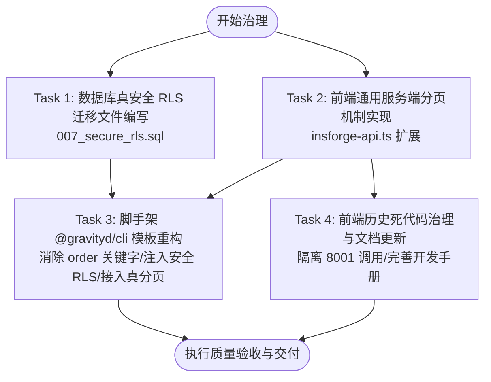

# 阶段3: ATOMIZE (原子化阶段) - 系统架构审核与治理

> 文档路径: `docs/系统架构审核与治理/TASK_系统架构审核与治理.md`  
> 规范依据: 团队 6A 工作流程规范 (阶段3: Atomize)  
> 责任团队: 架构评审委员会  

---

## 一、任务依赖关系图 (Mermaid)

---

## 二、原子化子任务分解清单

### Task 1: 数据库真安全 RLS 迁移文件编写 (`007_secure_rls.sql`)
- **任务目标**：彻底封堵任意已登录用户一键提权超管、清空系统角色及篡改菜单的 P0 漏洞。
- **输入契约**：
  - 前置依赖：现有 `001_system_schema.sql`、`003_system_extend.sql` 结构已就绪。
  - 依赖环境：PostgreSQL 15+ (InsForge Postgres)。
- **输出契约**：
  - 交付文件：`insforge-app/migrations/007_secure_rls.sql`。
  - 验收标准：
    1. 包含 `public.current_user_id()` 与 `public.is_superuser()` 判定函数；
    2. 废除 `authenticated_all` 策略，为 `profiles` 配置行级保护，禁止非超管变更 `is_superuser`；
    3. 为 `sys_role`、`sys_menu`、`sys_user_roles` 配置写权限仅对超管开放；
    4. 脚本末尾包含 `NOTIFY pgrst, 'reload schema';`。
- **实现约束**：不得修改或重跑 `002_seed_system.sql`。

---

### Task 2: 前端通用服务端分页机制实现 (`insforge-api.ts`)
- **任务目标**：废除全表拉取并在内存排序、分页的反模式，原生利用 PostgREST `range` 与 `count: 'exact'`。
- **输入契约**：
  - 前置依赖：`frontend/web/src/utils/insforge-api.ts` 已存在基础封装。
- **输出契约**：
  - 交付文件：更新 `frontend/web/src/utils/insforge-api.ts`，导出 `serverPageOf` 工具函数；
  - 交付测试：`frontend/web/src/utils/__tests__/insforge-api.test.ts`。
  - 验收标准：
    1. 函数签名清晰支持 `queryBuilder`、`pageNo`、`pageSize`、`sortField`、`ascending`；
    2. 正确调用 `.select('*', { count: 'exact' })` 与 `.range(from, to)`；
    3. 单元测试覆盖正常分页、空结果、边界溢出。
- **实现约束**：完全对齐现有 `ApiResponse<PageResult<T>>` 数据结构，保持对前端 `FaTable` 和 `useTable` 100% 兼容。

---

### Task 3: 脚手架 `@gravityd/cli` 代码生成模板重构
- **任务目标**：修复 CLI 自动复制漏洞与低效代码的问题。
- **输入契约**：
  - 前置依赖：Task 1 的 RLS 规范与 Task 2 的 `serverPageOf` 工具函数。
- **输出契约**：
  - 交付文件：`packages/gravityd-cli/lib/scaffold-sql-api.mjs`。
  - 验收标准：
    1. 生成的 SQL 不再出现 `"order"` 保留字，改为 `sort_order`；
    2. 生成的 SQL 带有针对 `owner_id = public.current_user_id() OR public.is_superuser()` 的安全 RLS；
    3. 生成的 API 代码直接调用 `serverPageOf`；
    4. 执行 `npm test`（或对应测试脚本）全部通过。
- **实现约束**：遵循 CLI 现有 ES 模块及非 TTY 规范。

---

### Task 4: 前端历史死代码治理与文档更新
- **任务目标**：隔离失效的 8001/FastAPI 调用，更新项目说明文档。
- **输入契约**：
  - 前置依赖：对全项目残留 8001 及 `/api/v1` 的检索清单。
- **输出契约**：
  - 交付文件：
    - `frontend/web/src/views/module_ai/chat/index.vue`（增加未部署降级提示，避免未捕获报错）
    - `docs/开发指南.md`（明确标注架构已切换为 BaaS，废弃 8001）
  - 验收标准：
    1. 点击 AI 对话等页面不再静默崩溃；
    2. 开发文档与实际架构无矛盾。
- **实现约束**：不破坏已有页面的 UI 结构，采用优雅降级与防御性编程。

---
EOF
