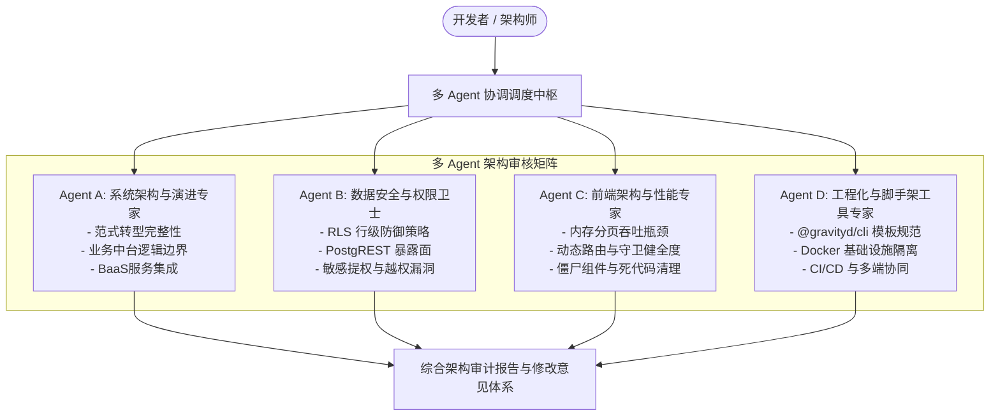
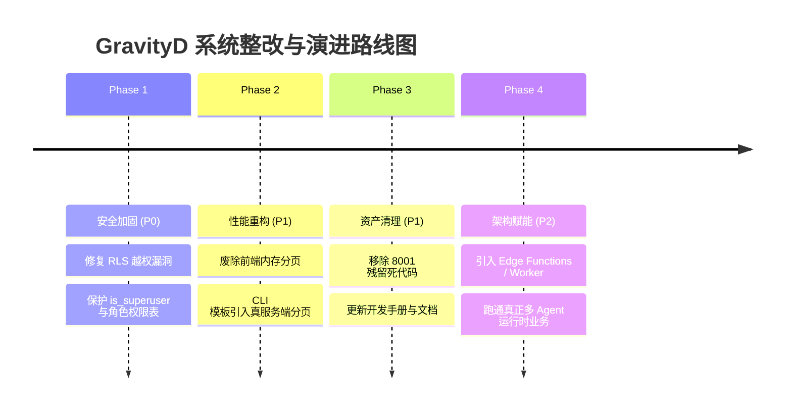

# 阶段2: ARCHITECT (架构设计) - 项目架构审核与多Agent设计

> 文档路径: `docs/项目架构审核与多Agent设计/DESIGN_项目架构审核与多Agent设计.md`  
> 规范依据: 团队 6A 工作流程规范 (阶段2: 系统架构设计)  
> 责任团队: 架构评审委员会 (Agent A, B, C, D 联合呈现)  

---

## 一、多 Agent 审核专家团协同拓扑架构

为确保对 GravityD 项目全生命周期代码架构与工程质量进行无死角审核与持续把关，系统设计了 4 个专业 Agent 构成的协作网络：



---

## 二、四大 Agent 深度审核会诊报告

---

### 2.1 Agent A 报告：系统架构与演进范式会诊

#### 1. 架构转型断层分析
- **现状**：项目刚由传统的 FastAPI 三层架构（Controller-Service-CRUD）转向自托管 InsForge BaaS（PostgreSQL + PostgREST + GoTrue Auth）。
- **严重问题（架构职责错位）**：
  在删除 FastAPI 后，原属于后端的复杂业务逻辑（如多表事务、聚合统计、复杂报表、数据校验、权限过滤、Excel 批量导入导出、定时调度）**被粗暴地抛给了前端 Vue 单页应用**或**直接搁置（抛出 `未迁移导出` 异常）**。
- **隐患评估**：
  - 前端不仅要做表现层渲染，还要兼任“BFF（Backend for Frontend）”，造成前端臃肿脆弱。
  - 缺乏事务隔离机制：前端通过 `@insforge/sdk` 发起多步 API 调用（例如创建用户并分配角色），若第二步网络中断，直接产生孤儿脏数据，且无法回滚。
- **演进架构设计建议**：
  引入 **双核驱动的 BaaS 架构体系**，通过 PostgreSQL Database Functions (PL/pgSQL) 或轻量级 Serverless Edge Functions 处理事务与复杂业务，保证前后端职责清晰。

```mermaid
graph LR
    subgraph ClientLayer [客户端层]
        Web[Vue3 管理后台]
        App[UniApp 移动端]
    end

    subgraph GatewayLayer [API 网关 & 路由]
        PostgREST[PostgREST 自动 REST API<br/>(基础 CRUD)]
        EdgeWorker[InsForge Edge Functions / Worker<br/>(复杂事务/批量导入导出/多Agent)]
    end

    subgraph DataLayer [PostgreSQL 核心数据底座]
        RLS[RLS 安全策略引擎]
        DBFunc[PL/pgSQL 存储过程 / 触发器]
        Tables[(业务表 / 系统表 / 向量表)]
    end

    ClientLayer --> PostgREST
    ClientLayer --> EdgeWorker
    PostgREST --> RLS --> Tables
    EdgeWorker --> DBFunc --> Tables
```

---

### 2.2 Agent B 报告：数据安全与权限体系会诊

#### 1. 【P0 致命安全隐患】虚假 RLS 策略与任意越权提权
- **代码现况**（参见 `insforge-app/migrations/001_system_schema.sql`、`003_system_extend.sql` 及 CLI 生成的业务迁移）：
  ```sql
  CREATE POLICY authenticated_all ON public.sys_dept FOR ALL TO authenticated USING (true) WITH CHECK (true);
  CREATE POLICY authenticated_all ON public.sys_role FOR ALL TO authenticated USING (true) WITH CHECK (true);
  CREATE POLICY authenticated_all ON public.sys_menu FOR ALL TO authenticated USING (true) WITH CHECK (true);
  CREATE POLICY authenticated_all ON public.profiles FOR ALL TO authenticated USING (true) WITH CHECK (true);
  CREATE POLICY authenticated_all ON public.sys_user_roles FOR ALL TO authenticated USING (true) WITH CHECK (true);
  ```
- **漏洞危害验证**：
  `USING (true) WITH CHECK (true)` 意味着任何一个拥有有效 Token 的已登录账号（无论是普通访客、离职员工还是临时用户），均可通过 PostgREST 接口发起如下请求：
  1. `PATCH /rest/v1/profiles?id=eq.<my-uuid>` 并提交 `{"is_superuser": true}`，直接**一键将自己提升为系统超级管理员**！
  2. `DELETE /rest/v1/sys_role`，直接**全量清空系统全部角色**！
  3. `POST /rest/v1/sys_user_roles` 随意给任意账号授予 `SUPER_ADMIN` 角色关联！
  前端所有的 `v-hasPermi` 权限指令、侧栏菜单过滤在 PostgREST 面前形同虚设！

#### 2. 【P1 安全隐患】菜单与角色权限完全依赖客户端内存过滤
- **代码现况**（`frontend/web/src/api/module_system/user.ts`）：
  ```ts
  async function loadMenusForUser(profile: ProfileRow, roleIds: number[]): Promise<MenuTable[]> {
    let query = insforge.database.from("sys_menu").select("*").eq("status", 0);
    if (!profile.is_superuser) {
      // 客户端先拉取 sys_role_menus，再通过 in 查询拉取菜单并在前端构建树
    }
  ```
  普通用户只需要打开浏览器 DevTools 执行 `insforge.database.from("sys_menu").select("*")`，即可看到全系统所有菜单、甚至高危运维入口的 URL 和路由元数据。

#### 3. 【P2 架构隐患】保留字列名冲突
- 表中包含列名 `"order"`（如 `public.sys_menu`、`public.sys_dept`、`public.sys_role` 以及 CLI 生成的所有业务表）。
- SQL 语法中 `ORDER` 是关键保留字，导致前端不能调用 `.order('order')`，被迫退化成在前端 JavaScript 中进行内存排序。

#### 4. 安全整改代码方案
建立**真正的 PostgreSQL RLS 安全策略函数**与**列级/行级隔离方案**：

```sql
-- 1. 创建获取当前请求用户 ID 与超级管理员判定的核心函数
CREATE OR REPLACE FUNCTION public.current_user_id() RETURNS UUID AS $$
  SELECT NULLIF(current_setting('request.jwt.claim.sub', true), '')::UUID;
$$ LANGUAGE SQL STABLE;

CREATE OR REPLACE FUNCTION public.is_superuser() RETURNS BOOLEAN AS $$
  SELECT EXISTS (
    SELECT 1 FROM public.profiles 
    WHERE id = public.current_user_id() AND is_superuser = true
  );
$$ LANGUAGE SQL STABLE SECURITY DEFINER;

-- 2. 重构 profiles 表的 RLS 策略（禁止非超级管理员修改 is_superuser）
DROP POLICY IF EXISTS authenticated_all ON public.profiles;

-- 所有人可读（或仅同部门/公开信息可读）
CREATE POLICY profiles_select_policy ON public.profiles
  FOR SELECT TO authenticated USING (true);

-- 普通用户只能修改自己的基础信息，且不能修改 is_superuser 字段
CREATE POLICY profiles_update_policy ON public.profiles
  FOR UPDATE TO authenticated
  USING (id = public.current_user_id() OR public.is_superuser())
  WITH CHECK (
    public.is_superuser() 
    OR (
      id = public.current_user_id() 
      AND is_superuser = (SELECT is_superuser FROM public.profiles WHERE id = public.current_user_id())
    )
  );

-- 3. 核心权限表（sys_role, sys_menu, sys_user_roles, sys_role_menus）只允许超级管理员增删改
DROP POLICY IF EXISTS authenticated_all ON public.sys_role;
CREATE POLICY sys_role_read ON public.sys_role FOR SELECT TO authenticated USING (true);
CREATE POLICY sys_role_write ON public.sys_role FOR ALL TO authenticated
  USING (public.is_superuser()) WITH CHECK (public.is_superuser());

-- 4. 业务表规范化（将保留字 order 改名为 sort_order 或 list_order）
-- 业务表 RLS 遵循：超管全权，普通用户按 owner_id / dept_id 隔离
```

---

### 2.3 Agent C 报告：前端架构与渲染性能会诊

#### 1. 【P1 性能瓶颈】全量拉取与内存分页（Memory Pagination Anti-Pattern）
- **代码现况**（CLI 脚手架模板及现有 `position.ts`, `dict.ts`, `notice.ts`）：
  ```ts
  const rows = ((unwrap(await builder) as PositionTable[]) || [])
    .sort((a, b) => (a.order ?? 0) - (b.order ?? 0));
  return ok(pageOf(rows.slice((pageNo - 1) * pageSize, pageNo * pageSize), rows.length, pageNo, pageSize));
  ```
- **危害分析**：
  1. 假分页：假设生产环境下客户表或操作日志有 50,000 条记录，每次翻页都会把 50,000 条完整 JSON 全部从网络拉回，前端解析耗时秒级，导致浏览器卡死甚至崩溃。
  2. PostgREST 截断 Bug：PostgREST 默认配置 `max-rows = 1000`。一旦表中数据超过 1000 条，未加分页的 `select('*')` 只会返回前 1000 条，前端算出的 `total` 永远停留在 1000，第 1001 条及之后的数据在页面上永远无法展示！

#### 2. 【P1 稳定性】死代码与僵尸路由残留
- `frontend/web/src/views/module_ai/chat/index.vue` 中第 99 行硬编码：
  ```ts
  const url = new URL("/api/v1/ai/chat/ws", WS_URL);
  ```
- `frontend/web/src/api/module_storage/transfer.ts` 中第 155 行仍请求：
  ```ts
  "/api/v1/task/storage/transfer/stream"
  ```
- 用户从工作台或菜单意外进入这些页面，会直接触发 WebSocket 报错、404 或未捕获的 Uncaught Promise 异常。

#### 3. 前端真实服务端分页重构方案
在 `frontend/web/src/utils/insforge-api.ts` 中提供统一的服务端分页助手函数：

```ts
/**
 * 生产级 PostgREST 服务端分页与总数统计包装
 */
export async function fetchServerPage<T>(
  queryBuilder: any,
  pageNo = 1,
  pageSize = 10,
  orderField = "id",
  ascending = false
): Promise<PageResult<T>> {
  const from = (pageNo - 1) * pageSize;
  const to = from + pageSize - 1;

  // 使用 PostgREST 原生的 range 与 exact count 响应头
  const response = await queryBuilder
    .select("*", { count: "exact" })
    .order(orderField, { ascending })
    .range(from, to);

  const { data, count, error } = response;
  if (error) {
    throw new InsforgeApiError(error.message || "查询失败");
  }

  const items = (data as T[]) || [];
  const total = typeof count === "number" ? count : items.length;

  return pageOf(items, total, pageNo, pageSize);
}
```

---

### 2.4 Agent D 报告：工程化与脚手架工具会诊

#### 1. 脚手架 CLI (`packages/gravityd-cli`) 问题
- **固化了架构缺陷**：
  `packages/gravityd-cli/lib/scaffold-sql-api.mjs` 在生成新模块时，默认写入：
  1. `order INTEGER NOT NULL DEFAULT 999`（保留字字段）
  2. `CREATE POLICY authenticated_all ... USING (true) WITH CHECK (true)`（无隔离 RLS）
  3. `rows.sort(...)` 和 `rows.slice(...)`（全量内存分页）
  每当开发者运行 `gravityd module add`，就会自动将不安全的 RLS 和低性能的内存分页复制到新的业务模块中！

#### 2. Docker 环境与脚本编排
- `scripts/init.sh` 和 `scripts/lib.sh` 设计了端口避让（将 Postgres 映射为 5433），非常周全。
- 但缺少与移动端 `frontend/app` 的联通脚本，且 `frontend/docs` 与代码严重脱节。

---

## 三、系统整改演进路线图 (Phase-based Action Plan)



---
EOF
